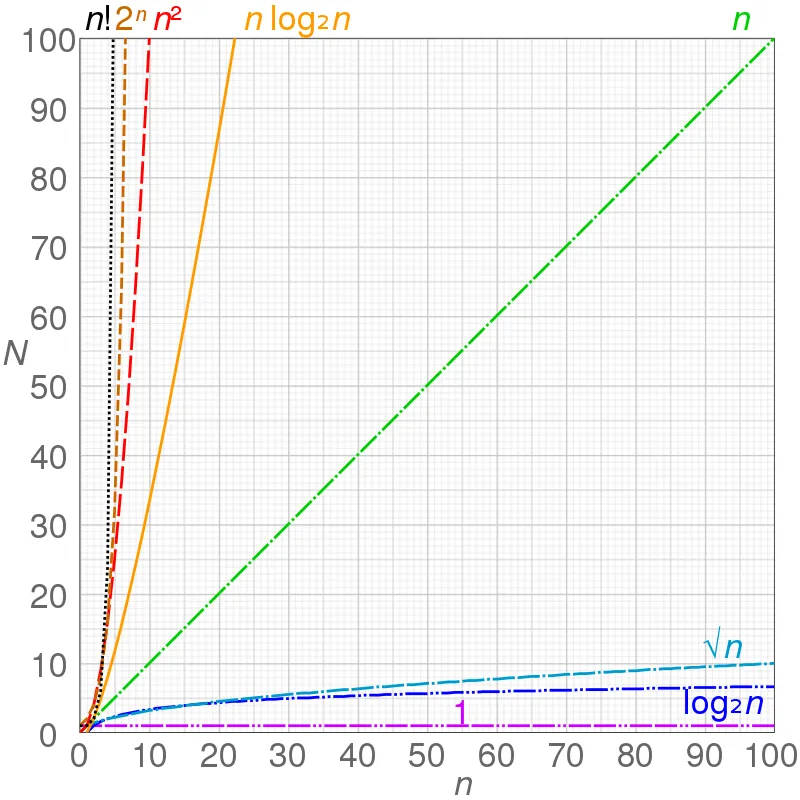

# 时间复杂度

用来定性描述该算法的运行时间, 用大O表示,比如O(1)、O(n)、O(n)、O(log n),重点关注一下几种类型:

- O(1)：常数时间复杂度，算法的运行时间与数据规模无关，比如打印输出语句。
- O(log n)：对数时间复杂度，算法的运行时间与数据规模的对数成正比，比如二分查找。
- O(n)：线性时间复杂度，算法的运行时间与数据规模成正比，比如简单排序算法。
- O(n^2)：平方时间复杂度，算法的运行时间与数据规模的平方成正比，比如简单选择排序算法「两层遍历」。
- O(n^3)：立方时间复杂度，算法的运行时间与数据规模的立方成正比，比如矩阵乘法。
- O(2^n)：指数时间复杂度，算法的运行时间与数据规模的指数成正比，比如递归算法。
