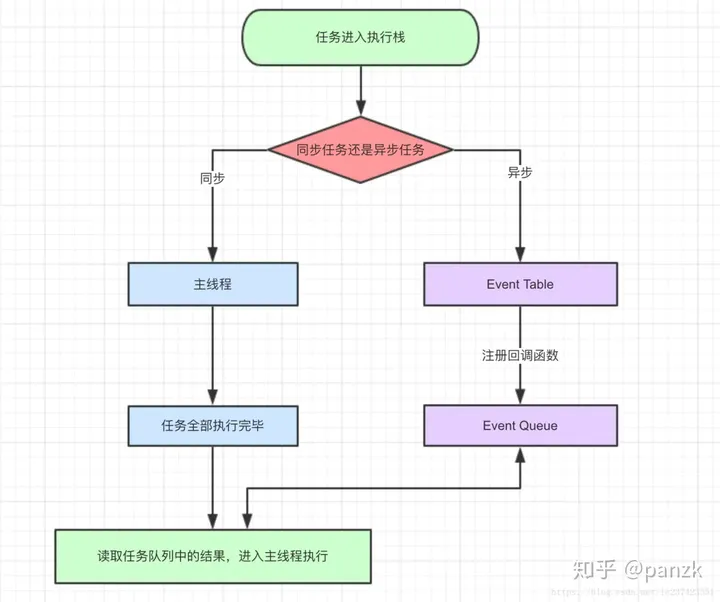
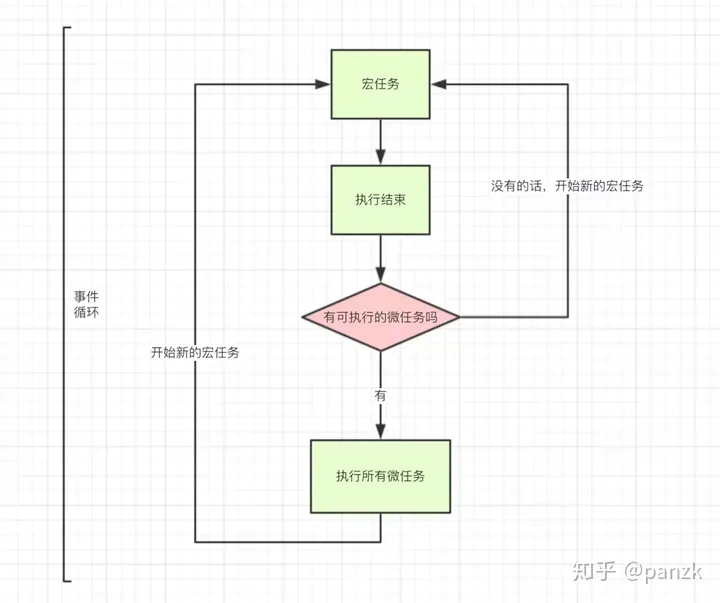

# 事件循环

先看一道面试题

<<< @/04-队列/4.4-异步中的任务队列/事件循环.js

## 简述

JavaScript 的事件循环（Event Loop）机制可以用一句话概括：
::: tip
JS 是单线程的，通过“事件循环”协调同步任务、异步任务的执行顺序。
:::

## 为什么需要事件循环

- JS 是 单线程（同一时间只能做一件事）
- 但 JS 又要处理 异步操作（定时器、网络请求、DOM 事件等）
- 事件循环就是用来 在不阻塞主线程的情况下处理异步任务

## 核心组成

事件循环主要涉及这几部分

- 调用栈（Call Stack）
  - 执行同步代码
  - 后进先出（LIFO）
- 任务队列（Task Queue）
  - 存放异步任务的回调
    分为：
    - 宏任务（Macro Task）
    - 微任务（Micro Task）
- 事件循环（Event Loop）
  - 不断检查：
    - 调用栈是否为空
    - 是否有可执行的任务

## 任务队列

JavaScript 引擎的运行机制是事件循环（event loop）。事件循环是一种单线程模型，它只执行一个任务，然后切换到另一个任务，如此反复，直到没有任务需要执行。

JavaScript 引擎的任务队列是一个先进先出（FIFO）的数据结构，里面存放着各种需要执行的任务。每当 JavaScript 引擎执行一个任务，就会从任务队列中取出最前面的一个任务，并执行它。

## 同步和异步任务

JavaScript 引擎的任务队列可以处理两种类型的任务：**同步任务**和**异步任务**。

### 同步任务

是指在主线程上排队执行的任务，只有前一个任务执行完毕，才能执行后一个任务。

### 异步任务

是指不在主线程上执行的任务，它会在任务队列中排队，等待主线程空闲时执行。

#### 宏任务和微任务

异步任务有两种类型：微任务（microtask）和宏任务（macrotask）。

1. **微任务**是指 promise、process.nextTick()、Object.observe()、MutationObserver 等。

2. **宏任务**是指 setTimeout、setInterval、setImmediate、I/O、UI rendering 等。

## 事件循环的顺序

规则总结：JavaScript 通过事件循环机制，在单线程环境下先执行同步任务，再清空微任务队列，最后执行宏任务，从而实现异步非阻塞执行。

::: tip
 同步 → 微任务 → 宏任务
:::

事件循环的顺序是： 同步任务 -> 微任务 -> 宏任务 -> 异步任务 -> 微任务 -> 宏任务 -> ...

1. 首先执行同步任务，这类任务包括各种函数调用、变量赋值、条件判断等。

2. 执行栈为空，查询是否有微任务需要执行。

3. 如果有微任务需要执行，则将它添加到微任务队列。

4. 然后执行微任务队列中的所有微任务。

5. 微任务执行完毕，再次查询是否有微任务需要执行。

6. 如果有微任务需要执行，则将它添加到微任务队列。

7. 然后执行宏任务队列中的所有宏任务。

8. 宏任务执行完毕，再次查询是否有微任务需要执行。

9. 如果有微任务需要执行，则将它添加到微任务队列。

10. 重复步骤 7-9，直到微任务队列和宏任务队列都为空。

11. 如果有异步任务需要执行，则将它添加到任务队列。

12. 然后开始下一轮事件循环，直到所有任务都执行完毕。

## 队列的应用

JavaScript 引擎的任务队列可以应用于很多方面，比如：

1. 异步加载脚本：JavaScript 引擎可以将脚本的加载任务放入任务队列，这样可以让浏览器逐步渲染页面，提高用户体验。

2. 定时器：JavaScript 引擎可以将定时器的回调函数放入任务队列，这样可以让定时器不影响页面的渲染。

3. 事件绑定：JavaScript 引擎可以将事件的回调函数放入任务队列，这样可以让事件的响应不影响页面的渲染。

4. 异步操作：JavaScript 引擎可以将异步操作的回调函数放入任务队列，这样可以让异步操作不影响页面的渲染。

5. 微任务：JavaScript 引擎可以将微任务（promise、process.nextTick()、Object.observe()、MutationObserver 等）的回调函数放入微任务队列，这样可以让微任务不影响页面的渲染。

6. 宏任务：JavaScript 引擎可以将宏任务（setTimeout、setInterval、setImmediate、I/O、UI rendering 等）的回调函数放入宏任务队列，这样可以让宏任务不影响页面的渲染。

7. 任务优先级：JavaScript 引擎可以设置任务的优先级，比如可以让某些任务优先于其他任务执行。

8. 任务取消：JavaScript 引擎可以取消某些任务，比如可以取消 setTimeout 定时器。

9. 任务暂停：JavaScript 引擎可以暂停某些任务，比如可以暂停 setInterval 定时器。

10. 任务超时：JavaScript 引擎可以设置任务的超时时间，比如可以设置 setTimeout 定时器的超时时间。

总之，JavaScript 引擎的任务队列可以帮助我们实现各种异步操作，提高页面的渲染效率。

## 参考

- [深入理解 JavaScript 之事件循环(Event Loop)](https://github.com/Jacky-Summer/personal-blog/blob/master/%E6%B7%B1%E5%85%A5%E7%90%86%E8%A7%A3JavaScript%E7%B3%BB%E5%88%97/%E6%B7%B1%E5%85%A5%E7%90%86%E8%A7%A3%20JavaScript%20%E4%B9%8B%E4%BA%8B%E4%BB%B6%E5%BE%AA%E7%8E%AF(Event%20Loop).md)
- [JavaScript中的Event Loop（事件循环）机制](https://segmentfault.com/a/1190000022805523#item-7)
- [面试必问之 JS 事件循环(Event Loop)，看这一篇足够](https://zhuanlan.zhihu.com/p/580956436)
