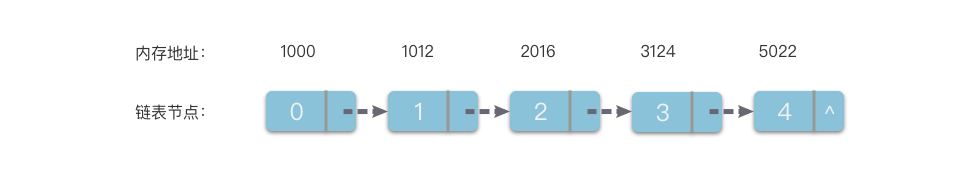

# 链表简介

- 多个元素组成的列表
- 元素存储不连续， 用next指针链接
- 链表的长度不固定，可以动态增长
- 链表的操作：插入、删除、查找、遍历

## 创建链表

<<< @/05-链表/5.1-链表简介/linked-list.js#snippet

## 基本操作

### 删除

<<< @/05-链表/5.1-链表简介/linked-list.js#snippet2

### 插入

<<< @/05-链表/5.1-链表简介/linked-list.js#snippet3

### 遍历

<<< @/05-链表/5.1-链表简介/linked-list.js#snippet4
