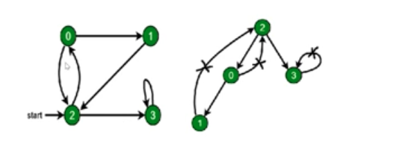

# 图的深度和广度优先遍历

## 深度优先遍历

## 解题思路

- 访问根结点
- 对根节点的**没有访问过的相邻节点**挨个进行深度优先遍历。

### 代码实现

<<< @/09-图/9.2-图的深度和广度优先遍历/图的深度优先遍历.js

## 广度优先遍历

### 解题思路

- 新建一个队列，把根节点入队
- 把队头出队并访问
- 把队头的**没访问过的相邻节点**入队
- 重复第二、三步， 直到队列为空

### 代码实现

<<< @/09-图/9.2-图的深度和广度优先遍历/图的广度优先遍历.js
