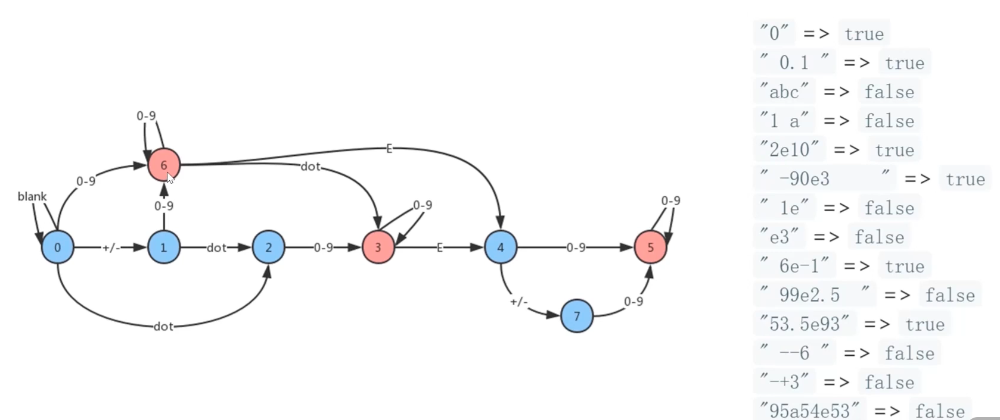

# [leetcode 65. 有效数字](https://leetcode.cn/problems/valid-number/description/)

## 解题思路

::: tip
  本题难点在于提供一个图，用来判断数字是否合法。
:::

- 构建一个图
  
- 遍历字符串，如果节点无路可走(currentState为undefined) => 返回false
- 如果最后状态停留在 4 5 6， 就是有效数字

## 代码实现

<<< @/09-图/9.3-有效数字/有效数字.js

## 复杂度分析

n：树的字符长度

- 时间复杂度 O(n)
- 空间复杂度 O(1)
