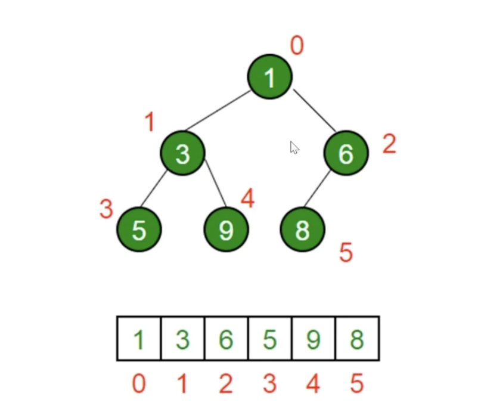

# 堆

## 堆是什么

- 堆是一种特殊的完全二叉树
- 所有节点都大于等于（最大堆）或小玉等于（最小堆）他的子节点。

## js中的堆

- 用数组表示堆，按照广度优先遍历的顺序存入数组，索引能代表位置。
- 左侧节点的位置是 2 * index + 1
- 右侧节点的位置是 2 * index + 2
- 父节点位置是 (index-1)/2 的商

## 堆的应用

- 高效找出最大值、最小值（时间复杂度： O(1)）
- 找出第K个最大（小元素）
  1. 构建一个最小堆，并将元素依次推入堆中
  2. 当堆堆容量超过K, 就删除堆顶
  3. 插入结束后， 堆顶就是第K个最大元素
